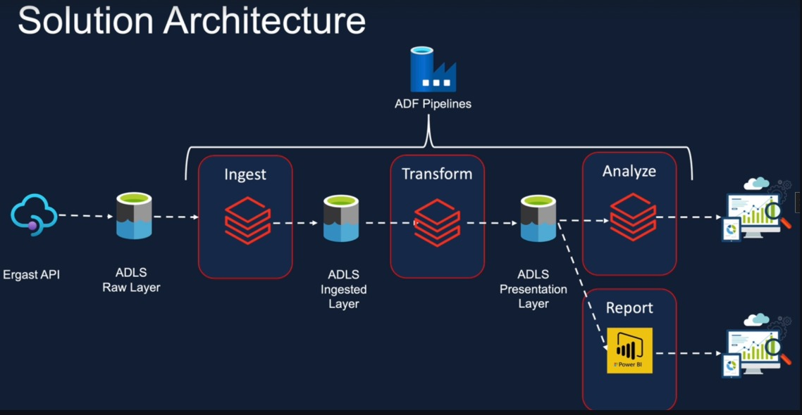

🔧 Designed and implemented a data pipeline architecture leveraging Azure Data Factory (ADF) and Azure Data Lake Storage (ADLS).
## 📌 Solution Architecture

⚙️ Key Highlights:

Ingested raw data from the Ergast API into the ADLS Raw Layer.

Orchestrated Ingest → Transform → Analyze workflows using ADF pipelines.

Applied transformations and stored processed data in Ingested and Presentation Layers for downstream consumption.

Enabled seamless integration with Power BI for advanced reporting and analytics.

This architecture demonstrates best practices in data ingestion, transformation, orchestration, and analytics integration within the Azure ecosystem.Azure Data Factory (ADF) – pipeline orchestration and ETL workflows

Azure Data Lake Storage (ADLS) – data lake design (Raw, Ingested, Presentation layers)

API Data Ingestion – extracting data from REST APIs (Ergast API)

Data Transformation & Cleaning – implementing ingestion and transformation logic

Data Modeling – structuring data for reporting and analytics

Power BI – building dashboards and reports for data visualization
